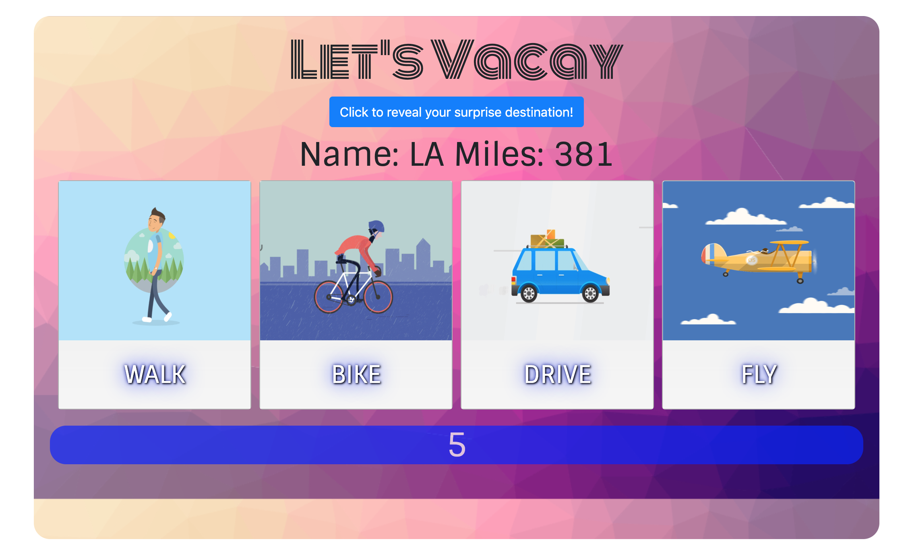

# Let's Vacay - Travel Miles Game
# INSTRUCTIONS
    * Click blue button to generate a random destination 
    * Destination and Distance will display on the screen 
    * Each vehicle/mode of transportation is associated with a unique distance in miles
    * Select the correct combination of vehicles to produce the exact number of miles as the distance displayed 
    * If the sum of miles is greater than the distance displayed, you lose and will have to generate a new destination
    * If the sum of miles matches the distance displayed exactly, you win! 

# Site 

# Technologies Used 
    * Bootstrap
    * HTML 
    * CSS
    * JavaScript 
    * jQuery 

# Authors
    * Megha Bindiganavale

